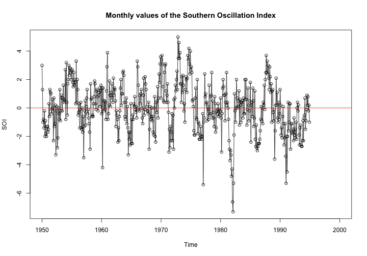
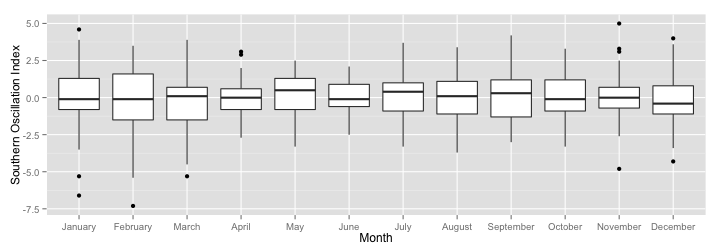
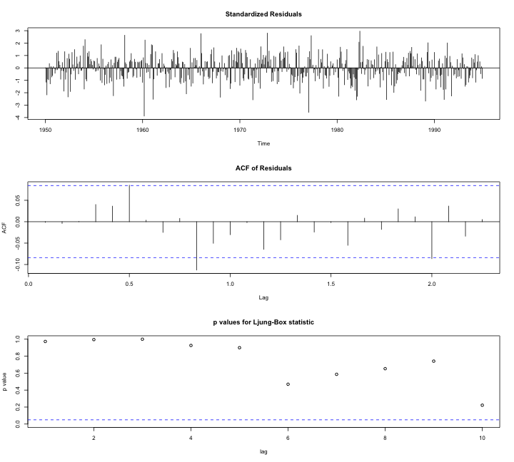
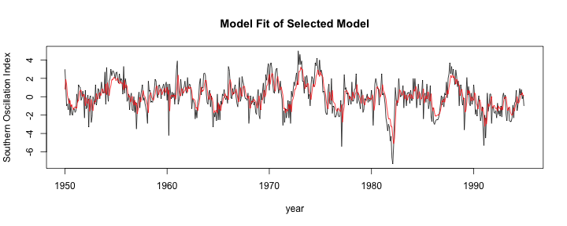

---
title       : TS Final Project
subtitle    : Southern Oscillation Index
author      : Xiang Liu (Dennis)
framework   : impressjs        # {io2012, html5slides, shower, dzslides, ...}
highlighter : highlight.js  # {highlight.js, prettify, highlight}
hitheme     : tomorrow      # 
widgets     : []            # {mathjax, quiz, bootstrap}
mode        : selfcontained # {standalone, draft}
knit        : slidify::knit2slides
github:
  user: XLdennis
  repo: TS-soi
--- 


### <b>title</b> : TS Final Project
### <b>subtitle</b>  : Southern Oscillation Index
### <b>author</b> : Xiang Liu (Dennis)

--- .slide x:-2000 y:-1500
# Data Information
</br>
### __Data source__: [Dr. Mike West's lab at Duke University](https://stat.duke.edu/~mw/ts_data_sets.html)
</br>
### __Variable__: Monthly values of the Southern Oscillation Index (SOI)
</br>
### __Yearly Data__: 1950-1994 (540 monthly observations)

--- .slide x:-1000 y:-1500

# Time Series Plot
 

<font size="3"> 
<p style="line-height:50%">
1. Time series overall seems to be stationary with little bit increasing variance since 1980. </br>
2. The Southern Oscillation Index (SOI) is the monthly fluctuations of air pressure difference between Tahiti and Darwin </br>
3. The consistent negative phase of the SOI represents a below-normal air pressure at Tahiti and above-normal air pressure at Darwin- El Niño (vice versa for positive value).

--- .slide x:0 y:-1500

# Check Stationary Process
  

<font size="3"> 
<p style="line-height:50%">

- 1: Both ACF and PACF plots show signs of stationary and suggest us to take a look at AR(p) model. 
- 2: Agmented Dickey-Fuller test also supports my thought. It's stationary at the p-value of 0.01.

--- .slide x:1000 y:-1500

# Decomposition Process
 
<font size="4"> 
<p style="line-height:50%">

- 1: Trend seem to be harmonic
- 2: There seems to be a strong pattern of seasonality, but let's find it out.

--- .slide x:2000 y:-1500

# Nonlinear Transformation
  
<font size="4"> 
<p style="line-height:50%">

- 1. Although lambda=1 isn't included in the 95% CI of BoxCox plot, high log liklihood still holds for non-transformation
- 2. There is a significant linear relationship between Ln(mean) and Ln(sd) and the parameter is 1.0 which suggests me not to take transformation (am I correct?)

--- #ing x:850 y:3000 rot:145 scale:5

- Since it's stationary already, let's go further to find if there is <b class="positioning">seasonality</b>^*

--- .slide x:6700 y:-280 z:0
# Time Series Plot of Seasonality
  
<font size="3.5"> 
- no strong seasonal pattern is detected, which doesn't seem to make sense to me!

--- .slide x:6700 y:-270 z:-1500
# Cumulative Periodgram
 
<font size="3.5"> 
- 1. It doens't look like white noise
- 2. There is no sudden jump at freq=0.8 which supports my hypothesis of no seasonality
- 3. More variance goes to the low frequencies. 

--- .slide x:6700 y:-270 z:-3000
# Spectral Analysis
 
<font size="3"> 
<p style="line-height:50%">
- 1. No matter if I detrend the data or not, the periodplot spike at a period of 60 month (5 years). 
- 2. As expected, strong pattern is seen at low frequencies. 
- 3. Still, it's odd not to see any seasonality given this is a climate index monthly data (freq=0.8)

--- #big x:3500 y:2100 z: 3000 rot:180 scale:5
<b>Next Step</b> <span class="thoughts">Let's fit an Arima model</span>

--- .slide x:2825 y:2325 scale:2
# ACF and PACF
  

--- .slide x:2825 y:2325 z:-3000 scale:2
# Model Specification

```
  AR(p) Differencing MA(q)      AIC
1     1            0     0 1852.783
2     1            0     1 1809.810
3     1            0     2 1811.795
4     1            0     3 1813.340
5     1            1     0 1867.570
6     1            1     1 1834.927
7     1            1     2 1812.566
8     1            1     3 1814.552
```
<font size="4"> 
- 
- 1. Since AIC suggests AR(1) and PAIC suggests an MA(1), I decide to take a look at all possibilities of ARIMA models
- 2. It seems that ARIMA(1,0,1) model has the smallest AIC value

--- .slide x:2825 y:3325 z:-3000
# Model Diagnose
 

--- #one-more-thing x:2800 y:3325 z:-3010 roty:-5
# ARIMA(1,0,1)

```
       ar1        ma1 
 0.8756591 -0.4333258 
```
<font size="5"> 
<p style="line-height:50%">
- 
- both AR and MA parameters are significant to be included in the model

--- .slide x:2345 y:2825 z:-2500 rot:30 
# Model Comparison 
 

--- #one-more-thing2 x:2320 y:2825 z:-2510 rot:30  roty:-5
# ARIMA(1,1,2)

```
       ar1        ma1        ma2 
 0.8764892 -1.4295726  0.4318771 
```
<font size="5"> 
<p style="line-height:50%">
- 
- 1. The model suggested by algorithms has higher AIC
- 2. Moreover, the $\theta_2$ isn't significant to be in the model. 

--- .slide x:1945 y:2225 z:-2400 rot:90
# Graphs
  

--- .slide x:2225 y:1600 z:-2300 rot:140
# Model Forecast
 
<font size="3"> 
<p style="line-height:50%">
- Using a built-up model to predict 12 month data approaching the future, the graph is good at forecasting the future values of the SOI index.
- It seems that SOI tend to go higher in the future and suggests more balanced climate at nothern Australia.(may need to further read some literature to interpret the data)

--- #its-in-3d x:2225 y:1600 z:-2300 rot:140 rotx:20 roty:20
# Thank <span class="you">You</span> for <span class="noticed"> Listening</span>

